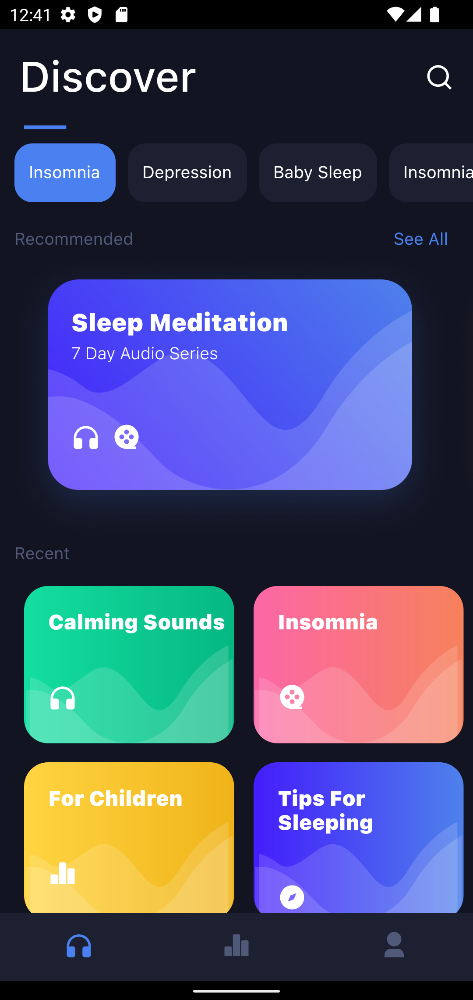

# Kunj Kanani Testing Application
## _Assignment application_

## Tech

## Plugins
  - cupertino_icons: ^1.0.2
  - flutter_svg: ^1.1.6
  
## Getting Started

This project is a starting point for a Flutter application.

A few resources to get you started if this is your first Flutter project:

- [Lab: Write your first Flutter app](https://flutter.dev/docs/get-started/codelab)
- [Cookbook: Useful Flutter samples](https://flutter.dev/docs/cookbook)

For help getting started with Flutter, view our
[online documentation](https://flutter.dev/docs), which offers tutorials,
samples, guidance on mobile development, and a full API reference.

### Screenshots 📱

